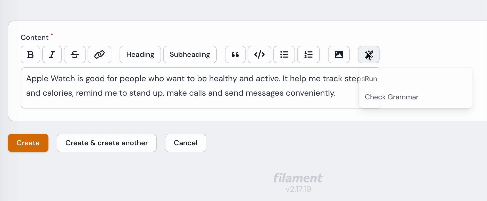

# GPT Trix Editor 🪄 

GPT Trix Editor package is a field component that extends the default Trix editor with OpenAI GPT features in the Filament PHP framework.



## Installation

You can install the package via composer:

```bash
composer require askerakbar/gpt-trix-editor
```

## Quick Start

1. Publish the configuration files by running the following commands:

```bash
php artisan vendor:publish --provider="OpenAI\Laravel\ServiceProvider"
php artisan vendor:publish --tag="gpt-trix-editor-config"
php artisan vendor:publish --tag="gpt-trix-editor-translations"
```

2. We're using https://github.com/openai-php/laravel laravel package to call the OpenAI APIs, so you need to set your OpenAI API key in the .env file or in the config/openapi.php file:
```env
OPENAI_API_KEY=YOUR_KEY
```

3. Optionally, you can customize the configuration file at config/gpt-trix-editor.php. This includes adding more prompts to the menu dropdown, setting temperature and max_tokens.
4. Clear the configuration cache to make sure your changes take effect:
```php artisan config:clear ```
5. Done!

# Usage

Import the field component: 
```php
use AskerAkbar\GptTrixEditor\Components\GptTrixEditor;
```

You can use the GPT Trix Editor field component like any other field component:

```php
GptTrixEditor::make('content')->columnSpan('full');
```

By default, the GPT Toolbar Button is enabled in the GP Trix Editor. However, if you want to disable it, you can do so like this:

```php
GptTrixEditor::make('content')->disableToolbarButtons([
    'gptTools',
])->columnSpan('full');
```

## To do 
- [ ] Run the GPT actions on selected/highlighted text 

## Contribute / Report a bug / Security Vulnerabilities
If you would like to contriubte, please feel free to submit pull requests or open issues.

## License

The MIT License (MIT). Please see [License File](LICENSE.md) for more information.
